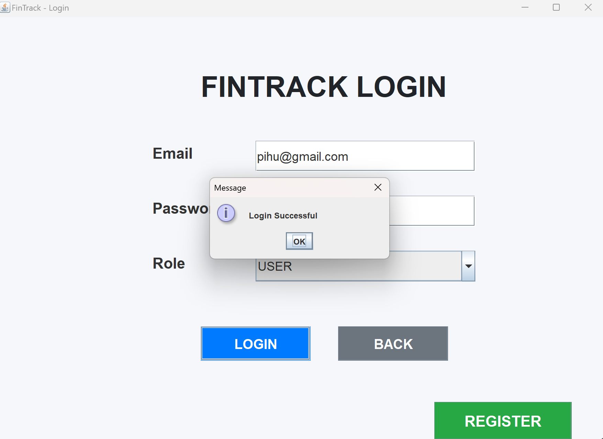
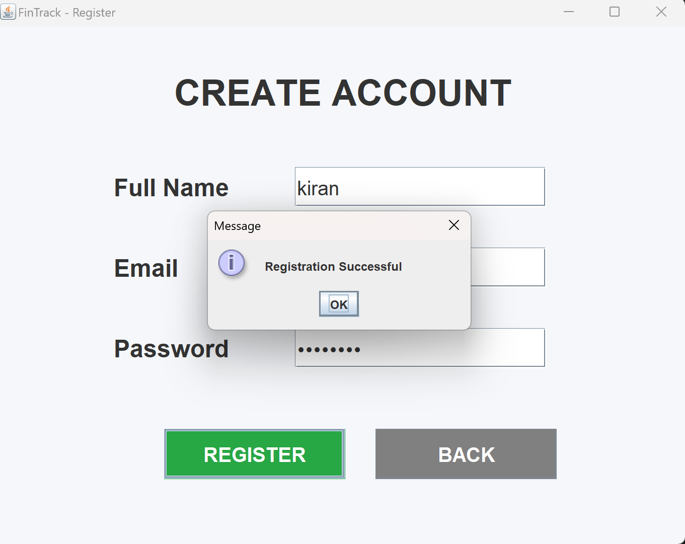
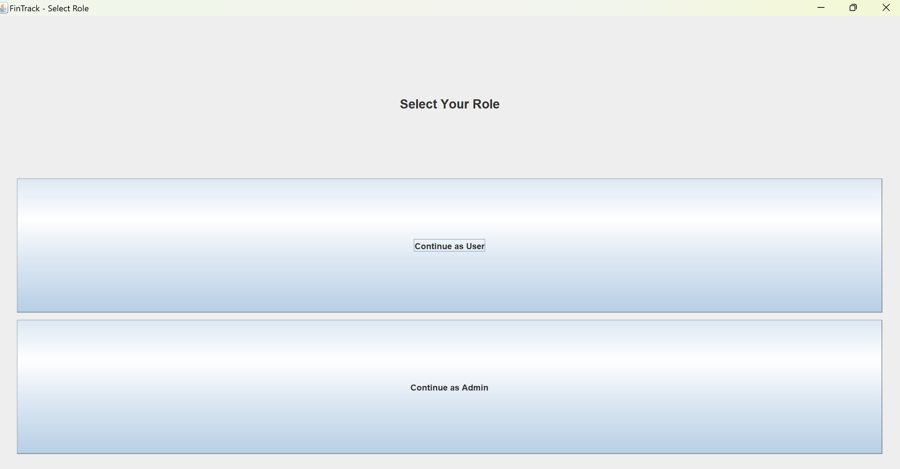
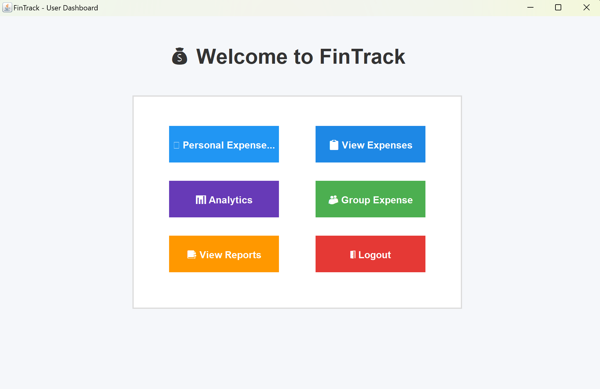
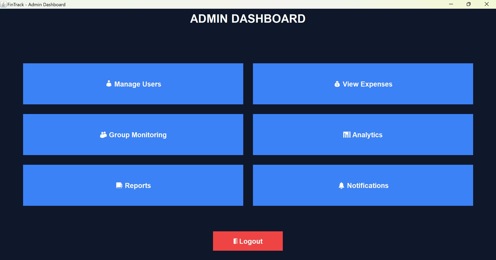
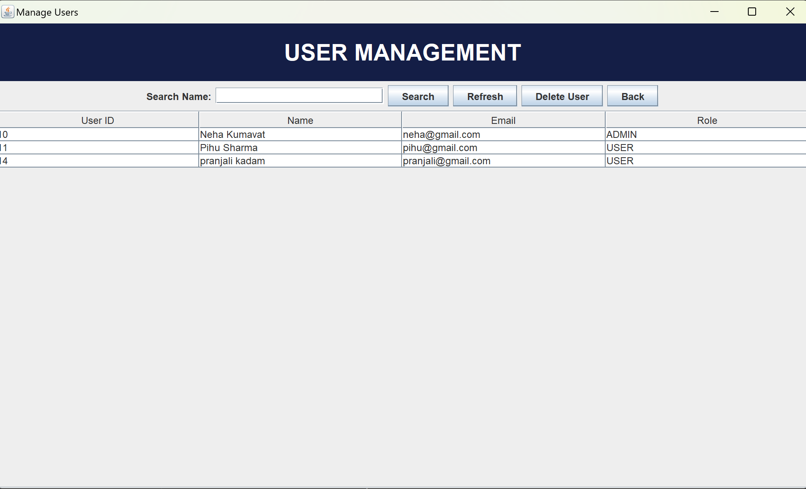
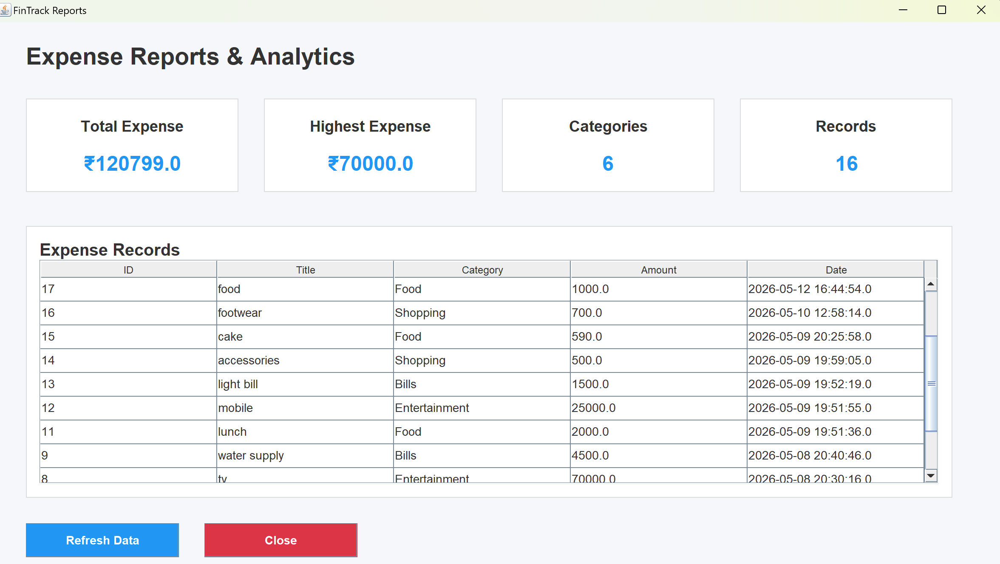
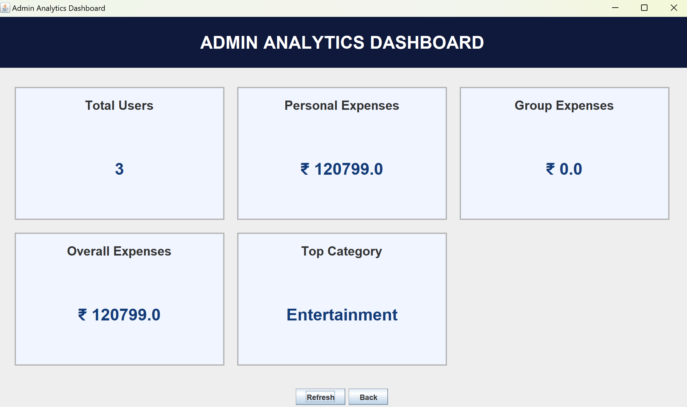
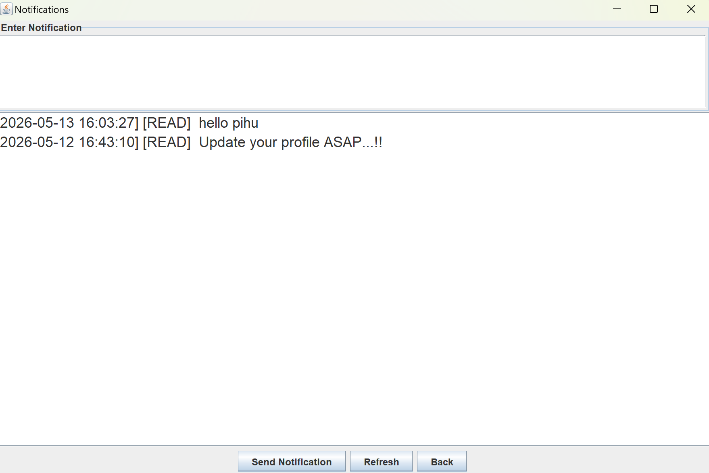

# 💰 FinTrack System - Intelligent Expense Optimizer

A desktop-based Expense Management System built using **Java Swing** and **MySQL** that helps users track expenses efficiently while providing administrators with powerful management and analytics capabilities.

## 🚀 Features

### 👤 User Features
- Secure Login & Registration
- Role-Based Access Control
- Personal Expense Tracking
- Expense Categorization
- Dashboard Overview
- Expense Reports & Analysis
- Notification System

### 🛠️ Admin Features
- User Management
- Expense Monitoring
- Analytics Dashboard
- Report Generation
- System Notifications
- Group Monitoring

## 🖼️ Application Screenshots

### 🔐 Login Page

### 📝 User Registration

### 🎭 Role Selection

### 👤 User Dashboard

### 👨‍💼 Admin Dashboard

### 👥 User Management

### 📊 Expense Report Analysis

### 📈 Admin Analytics Dashboard

### 🔔 Notification Center

## 🏗️ Tech Stack

| Technology | Usage |
|------------|--------|
| Java | Core Application Logic |
| Java Swing | Desktop User Interface |
| MySQL | Database Management |
| JDBC | Database Connectivity |
| VS Code | Development Environment |
| Git & GitHub | Version Control |

## 📂 Project Structure

FinTrack-System
│
├── screenshots/
├── src/
│   └── main/
│       ├── java/
│       │   └── com/
│       │       └── fintrack/
│       │           ├── config/
│       │           ├── controller/
│       │           ├── dao/
│       │           ├── model/
│       │           ├── ui/
│       │           └── utils/
│       └── resources/
│
├── logs/
├── lib/
└── README.md

## ⚙️ Installation

### 1️⃣ Clone Repository
git clone https://github.com/gitneha17/FinTrack-System.git

### 2️⃣ Open Project
Open the project in VS Code or any Java IDE.

### 3️⃣ Configure Database
- Install MySQL
- Create the required database
- Update database credentials in the configuration file

### 4️⃣ Add JDBC Driver
Place MySQL Connector JAR inside the `lib/` folder.

### 5️⃣ Run Application
Run:
Main.java

## 🎯 Key Highlights

✅ Role-Based Authentication
✅ Expense Tracking & Management
✅ Admin Analytics Dashboard
✅ User Management Module
✅ Report Generation
✅ Notification System
✅ Clean Java Swing UI
✅ MySQL Database Integration

## 👩‍💻 Author

**Neha Beldar**

🔗 GitHub: https://github.com/gitneha17

## 📜 License

This project is developed for educational and portfolio purposes.
